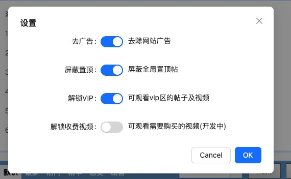
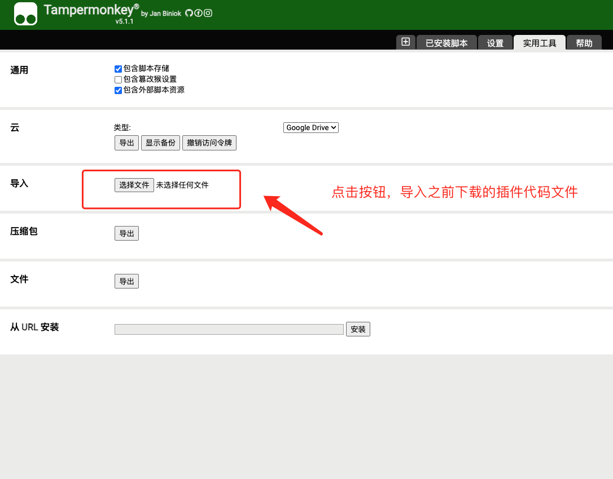
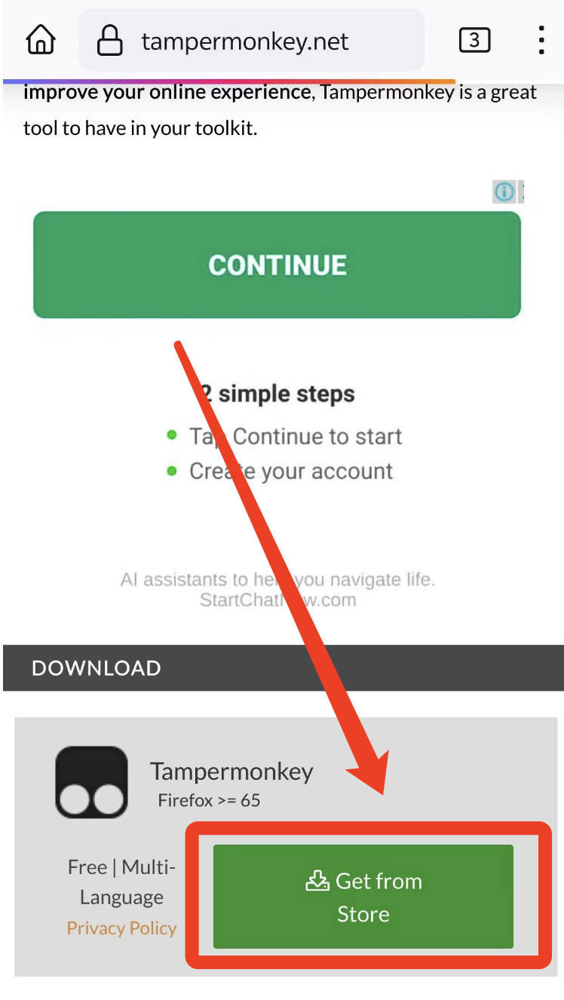
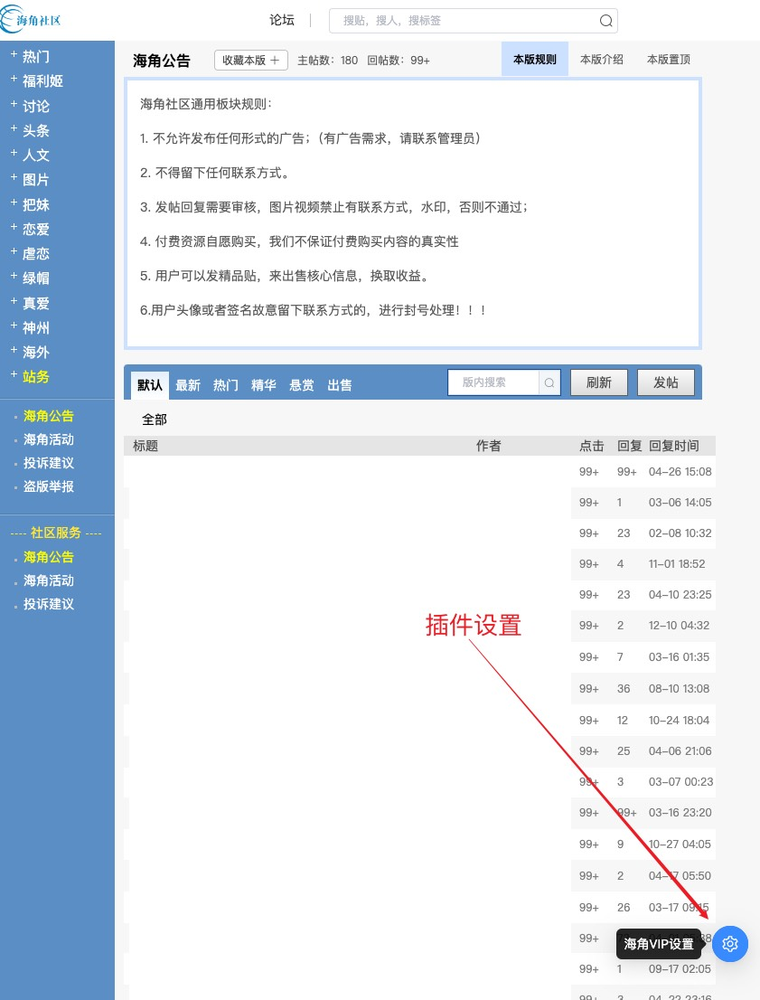
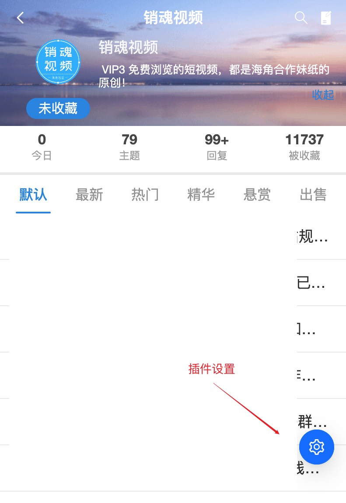

# 海角社区(haijiao.com) - 解锁收费视频,VIP,去广告脚本

该脚本完全免费并开源,遵守MIT协议.

开源代码托管在: [haijiao_vip](https://github.com/sex4096/haijiao_vip/)

TG讨论群:[@svip_hj0](https://t.me/svip_hj0)

TG频道: [@svip_nav](https://t.me/svip_nav)

## 无法安装或者使用:

视频解析站: [4096se.com](https://4096se.com)

```
VIP视频解析站: https://4096se.com

把要看的网址输入就可以直接解析收费视频

目前支持: 海角论坛, 91Porn, 19JTV

方便无法安装插件的兄弟们,后续将陆续增加可以解析的站点.

```

## 声明

从2024/4/30晚开始,服务器被大量攻击,脚本被恶意举报,怀疑影响到某些人的利益了.

再次声明,该脚本永久免费使用,不接受捐赠,不设立内群. 请一定一定注意甄别,防止上当受骗!

2024/5/30日,聊天解析群被举报封禁,请加新群:[@svip_hj0](https://t.me/svip_hj0)

## 功能

- 去广告
- 屏蔽全局置顶贴
- 解锁VIP板块帖子
- 手机版适配
- 解锁钻石和金币帖子
- 屏蔽落地页弹窗
- 查看被封禁用户
- 搜索可返回被封禁的用户
- 下载视频



# 如何下载视频

1. 加入telegram群组: [@svip_hj0](https://t.me/svip_hj0)
2. 复制要下载的`帖子`链接发送到群组
3. 机器人会发送视频给你,即可下载.

## 说明

### 目前需要登录网站才可以使用!!!

### 目前需要登录网站才可以使用!!!

### 目前需要登录网站才可以使用!!!

如果找不到设置,请检查访问的网站是否为`haijiao.com`

该脚本对`底层请求`添加了`拦截器`, 通过修改请求来达到解锁视频,VIP,去广告等功能,不对页面元素做任何修改

## 免费获取服务地址

`因为脚本服务频繁被攻击,所以服务地址将经常变动`

telegram订阅该频道,然后通过公告来免费获取服务地址
[https://t.me/svip_nav](https://t.me/svip_nav)

## 安装

### PC端:

##### 第一种方式:

正常Tampermonkey安装`haijiao.js`即可

`https://raw.githubusercontent.com/sex4096/haijiao_vip/master/haijiao.js`

##### 第二种方式:

1. 下载源代码到本地: `https://github.com/sex4096/haijiao_vip/blob/master/haijiao.js`
2. chrome谷歌浏览器安装 <b>篡改猴</b> 插件:

   ```
   插件下载地址

   https://tampermonkey.net/

   或者通过谷歌应用商店搜索 篡改猴
   ```

3. 安装海角社区vip解锁插件:
   

### 安卓:

1. 下载源代码到手机

   ```
   源代码下载地址

   https://github.com/sex4096/haijiao_vip/blob/master/haijiao.js
   ```

2. 下载火狐浏览器
   ```
   安卓手机打开网址 [https://www.firefox.com.cn/](https://www.firefox.com.cn/) 下载火狐浏览器
   ```
3. 火狐浏览器安装 <b>篡改猴</b> 插件

   ```
   在火狐浏览器中，输入网址 https://tampermonkey.net/

   在官网安装篡改猴插件
   ```

   

4. 安装海角社区vip解锁插件
   ```
   进入篡改猴的控制面板，在实用工具里，导入下载好的代码文件
   ```

### iOS:

- Safari浏览器+Stay插件
- Focus浏览器

```
基本安装方法同安卓一样,省略吧
```

## Surge|QuantumultX 模块

由于移动端对于油猴的支持性很差,所以制作了这么一个脚本,用于注入解锁脚本.

安装模块后,全局浏览器都可以使用脚本了.

有一定使用门槛,小白建议不要折腾,老老实实浏览器添加脚本.

项目地址: [haijiao_vip_vpn](https://github.com/sex4096/haijiao_vip_vpn)

## 贡献

欢迎大佬贡献代码,基本调用如下:

比如调用网站的确认信息框并且在点击确认后弹出登录窗口:

```typescript
VUE.prototype.$message.close();
VUE.prototype
  .$confirm("您暂时还未登录,海角VIP脚本无法生效,请登录", "提示", {
    confirmButtonText: "确定",
    cancelButtonText: "取消",
    type: "warning",
  })
  .then(() => {
    VUE.prototype.$loginWindow();
  });
```

## 截图

设置界面在这里:

PC端:


移动端:


